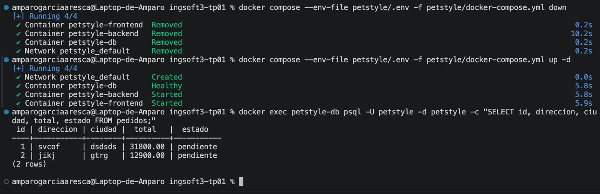
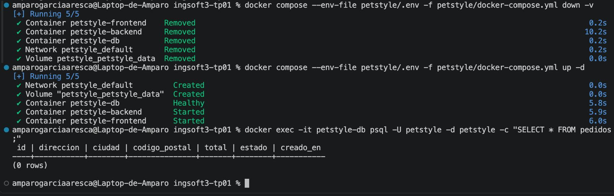
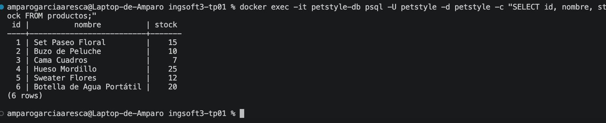
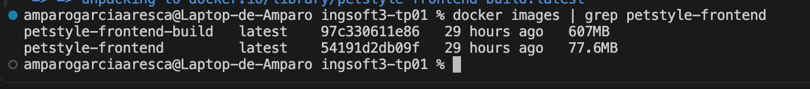
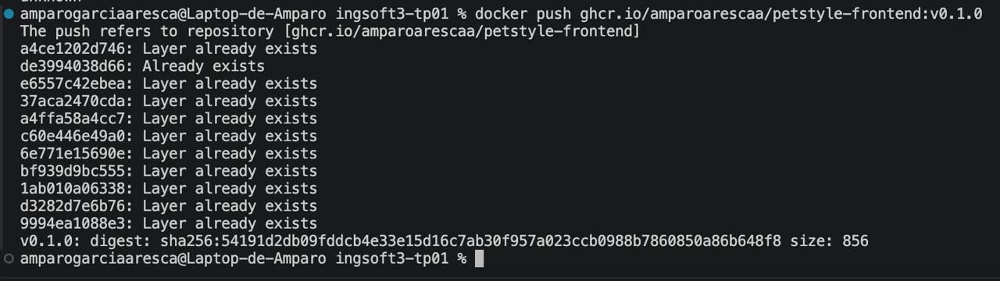
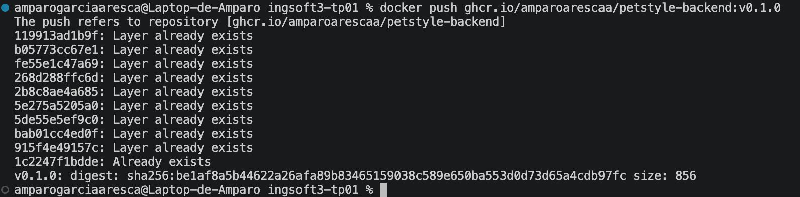
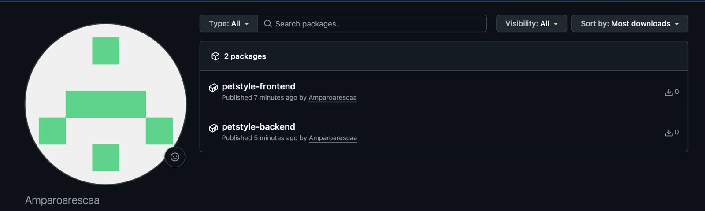
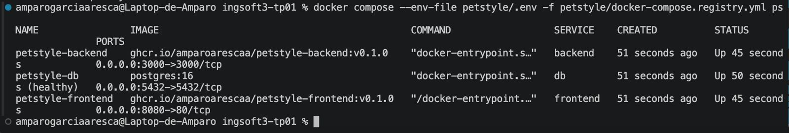
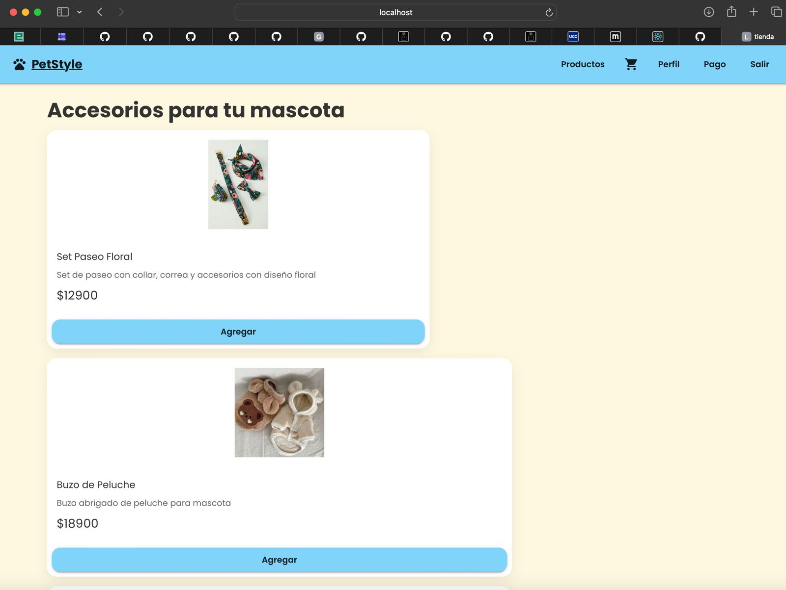

# Evidencias del TP01

## 1. Push directo a main rechazado

Se intentó realizar un `push` directamente sobre la rama `main`. GitHub rechazó la operación debido a la regla de protección configurada, que exige que los cambios se incorporen mediante Pull Requests.

## 2. Conflicto de merge

Se generó intencionalmente un conflicto modificando la misma línea del archivo `README.md` desde dos ramas diferentes. Al intentar integrar la segunda rama, GitHub detectó el conflicto e impidió realizar el merge automáticamente.

## 3. Resolución del conflicto

El conflicto se resolvió manualmente desde el editor de GitHub, comparando las dos versiones y seleccionando el contenido que debía conservarse.

## 4. Release v1.0.0

Se creó el tag `v1.0.0` y posteriormente se publicó la release correspondiente en GitHub como entrega del TP01.

---

# Evidencias del TP02 — Contenedores

## 1. Persistencia de datos con Docker Compose

Se comprobó la persistencia de PostgreSQL utilizando el volumen `petstyle_data`.

Luego de crear pedidos, se ejecutó `docker compose down` para eliminar los contenedores y posteriormente `docker compose up -d` para volver a crearlos.

Al consultar nuevamente la tabla `pedidos`, los registros continuaban almacenados, demostrando que los datos se conservaron mediante el volumen.

## 2. Eliminación del volumen

Se ejecutó `docker compose down -v`, eliminando tanto los contenedores como el volumen utilizado por PostgreSQL.

Después de volver a levantar los servicios, la consulta a la tabla `pedidos` devolvió cero registros, comprobando que los datos persistidos habían sido eliminados junto con el volumen.

## 3. Reinicialización de la base de datos

Después de eliminar el volumen y levantar nuevamente los servicios, PostgreSQL creó una nueva base de datos y ejecutó `init.sql`.

Se verificó que los seis productos iniciales fueran cargados nuevamente con sus valores de stock originales.

## 4. Comparación de tamaños de imágenes

Se comparó la imagen correspondiente a la etapa de construcción del frontend con la imagen final utilizada para ejecutar la aplicación.

La etapa de build basada en Node.js ocupa aproximadamente 607 MB, mientras que la imagen final basada en Nginx ocupa aproximadamente 77,6 MB.

Esto permite comprobar el beneficio del Dockerfile multi-stage al evitar incluir en la imagen final herramientas y dependencias utilizadas únicamente durante la construcción.

## 5. Publicación de la imagen del frontend

Se publicó la imagen del frontend en GitHub Container Registry utilizando la versión `v0.1.0`.

Imagen publicada:

`ghcr.io/amparoarescaa/petstyle-frontend:v0.1.0`

## 6. Publicación de la imagen del backend

Se publicó la imagen del backend en GitHub Container Registry utilizando la versión `v0.1.0`.

Imagen publicada:

`ghcr.io/amparoarescaa/petstyle-backend:v0.1.0`

## 7. Imágenes disponibles en GitHub Container Registry

Se verificó la publicación de los paquetes correspondientes al frontend y backend de PetStyle en GitHub Container Registry.

## 8. Ejecución utilizando las imágenes publicadas

Se levantó la aplicación mediante `docker-compose.registry.yml`, utilizando las imágenes `v0.1.0` publicadas en GitHub Container Registry en lugar de construirlas localmente.

Se verificó que los servicios `frontend`, `backend` y `db` estuvieran en ejecución y que PostgreSQL alcanzara el estado `healthy`.

## 9. Aplicación PetStyle funcionando

Finalmente, se verificó el funcionamiento de PetStyle desde el navegador en `localhost:8080`.

La aplicación carga correctamente el catálogo de productos obtenido mediante el backend y PostgreSQL.

