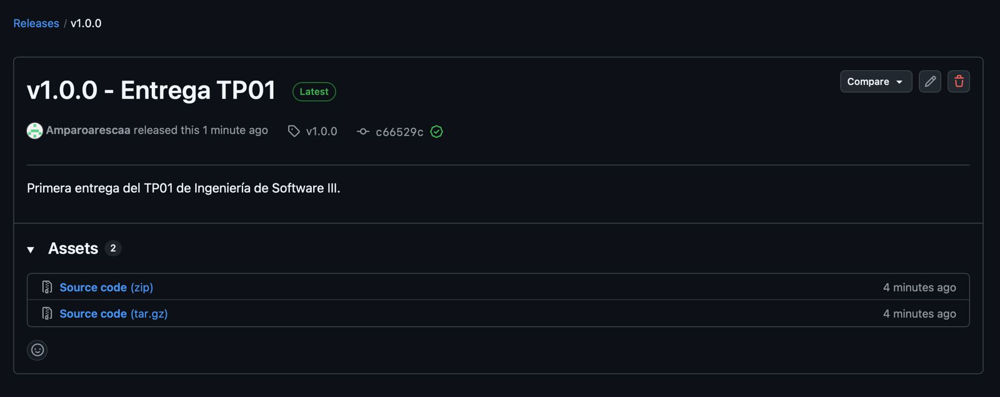
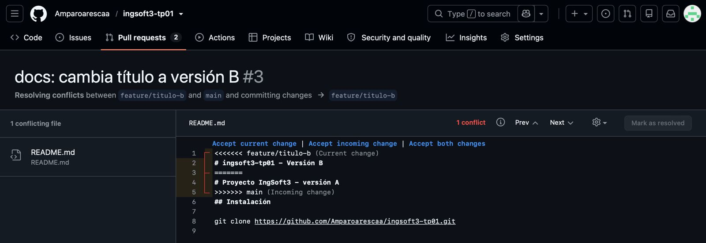
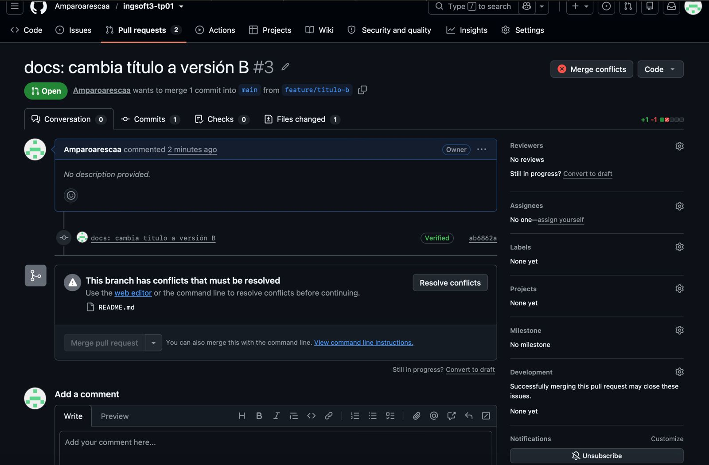
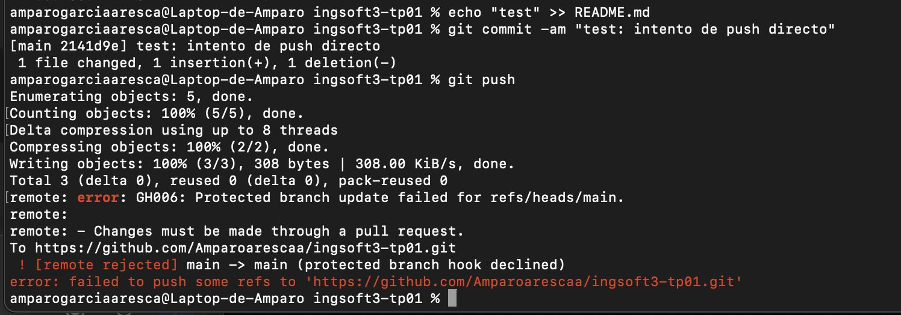

# Evidencias del TP01

## 1. Push directo a main rechazado

Se intentó realizar un `push` directamente sobre la rama `main`. GitHub rechazó la operación debido a la regla de protección configurada, que exige que los cambios se incorporen mediante Pull Requests.

## 2. Conflicto de merge

Se generó intencionalmente un conflicto modificando la misma línea del archivo `README.md` desde dos ramas diferentes. Al intentar integrar la segunda rama, GitHub detectó el conflicto e impidió realizar el merge automáticamente.

## 3. Resolución del conflicto

El conflicto se resolvió manualmente desde el editor de GitHub, comparando las dos versiones y seleccionando el contenido que debía conservarse.

## 4. Release v1.0.0

Se creó el tag `v1.0.0` y posteriormente se publicó la release correspondiente en GitHub como entrega del TP01.

